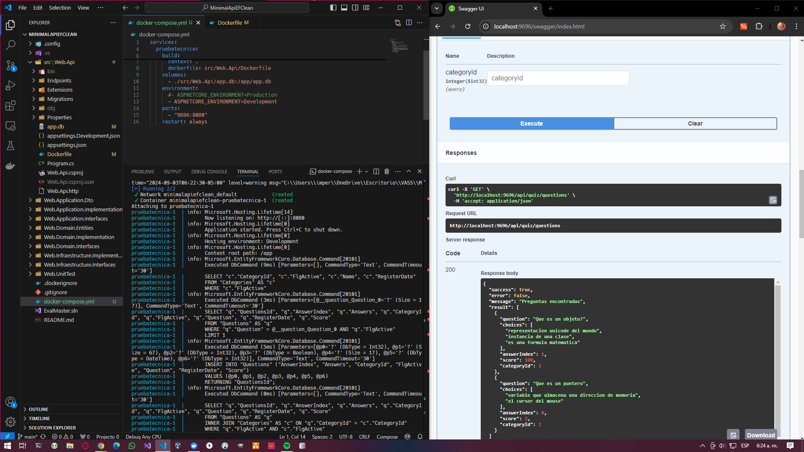

# MinimalApiEFClean

Prueba tecnica Arquitectura clean + EF + MinimalApi + SqlLite

# Comandos de despliegue

posicionarse al nivel de docker-compose.yml y ejecutar los siguentes comandos

```
docker-compose build --no-cache
docker-compose up -d
```

ingresar a [http://localhost:9696/swagger/index.html](http://localhost:9696/swagger/index.html)

# Endpoints

```
@api_prueba_tecnica = http://localhost:9696

### Get all Category of questions
GET {{api_prueba_tecnica}}/api/quiz/category
Accept: application/json

### Get Questions by categoryId if its null get all questions
GET {{api_prueba_tecnica}}/api/quiz/questions?categoryId=1
Accept: application/json

### Create new questions
POST {{api_prueba_tecnica}}/api/quiz/questions
Accept: application/json

{
  "question": "string",
  "choices": [
    "string"
  ],
  "answerIndex": 0,
  "score": 0,
  "categoryId": 0
}

### Delete a question by questionId
DELETE {{api_prueba_tecnica}}/api/quiz/questions?questionId=9
Accept: application/json
```

# Persistencia

Asi el projecto se este ejecutando desde visual studio o desde el docker. toda la persistencia quedara dentro del archivo `src/Web.Api/app.db`.

al momento de buildear la imagen se copia el archivo adentro del docker

```
COPY src/Web.Api/app.db /app/app.db
CMD ["chmod", "664" "./app/app.db"]
```

y Cuando se despliega desde docker-compose se vincula el archivo dentro del docker con el archivo local del proyecto

```
volumes:
      - ./src/Web.Api/app.db:/app/app.db
```

# Imagen funcionando




